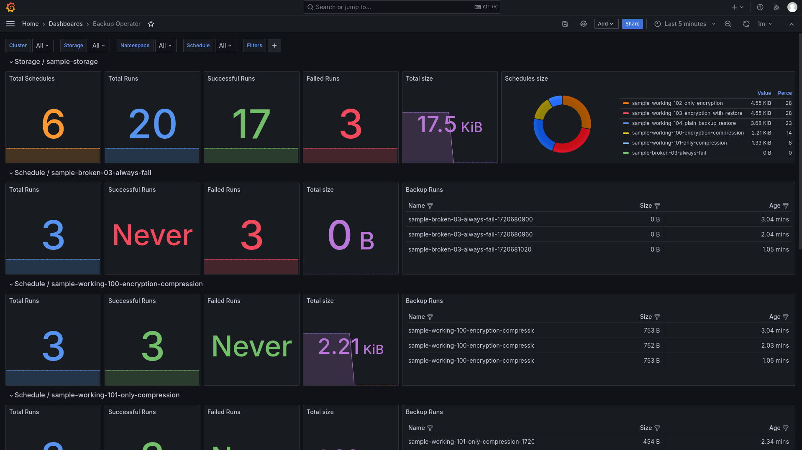

Backup Operator
===



[](https://artifacthub.io/packages/search?repo=backup-operator)

Kubernetes Go operator that creates and restores any backups.

Operator controls creation and **restoration** of backups. You create *BackupStorage* that will be used for storing backups generated by *BackupRuns*, while BackupRuns are created on schedule according to *BackupSchedule*.

## Getting started

```shell
helm repo add backup-operator https://helm-charts.backup-operator.io/
helm repo update
helm install backup-operator backup-operator/backup-operator
```

## Annotations

### BackupRun

| Name | Description |
|-------------|-------|
| `backup-operator.io/keep` | Set to any value and BackupSchedule won't delete this run during the rotation |
| `backup-operator.io/restored-at` | It is set by operator after the restoration is completed successfully |
| `backup-operator.io/restore` | Set to any value in case if you want to restore the backup |

### BackupSchedule

| Name | Description |
|-------------|-------|
| `backup-operator.io/trigger` | Can be set to any value to trigger schedule manually |

### BackupStorage

| Name | Description |
|-------------|-------|
| `backup-operator.io/deletion-protection` | Is set automatically and prevents accidental storage deletion |

## Monitoring

Grafana dashboard is located at [here](etc/grafana-dashboard.json).

## Contributing

You’ll need a Kubernetes cluster to run against. You can use [KIND](https://sigs.k8s.io/kind) to get a local cluster for testing, or run against a remote cluster.
**Note:** Your controller will automatically use the current context in your kubeconfig file (i.e. whatever cluster `kubectl cluster-info` shows).

If you already have KIND installed, you can easily create and delete cluster using [task](https://taskfile.dev).

```shell
task src:kind:create
```

Here you will find other tasks available

```shell
task --list-all
```

After you run kind_create, kubeconfig.yaml will be created in current directory.

Ports Map

| Service         | Port |
| --------------- | ---- |
| Minio (S3 API)  | 9000 |
| Minio (Web UI)  | 9001 |
| Chart Museum    | 9002 |
| Grafana         | 9003 |
| Docker Registry | 5000 |

## Running the operator

Choose one of the options below.

### 1. Installing from manifests

```shell
task src:manifest:run
```

### 2. Running Go locally

Now, you can install CRDs.

```shell
task src:crds:install
```

Now you can either launch the application with go (but without webhooks)...

```shell
task src:go:run
```

### 3. Deploying in Helm chart

```shell
task src:chart:run
```

## Examples

Once both database and storage are ready, continue with deploying our CRD. Check [samples](config/samples/_v1_backupschedule.yaml) for more details.

```shell
kubectl apply -f config/samples/99_common
kubectl apply -f config/samples/10_encryption_compression
```

## Description

// TODO(user): An in-depth paragraph about your project and overview of use

### Running on the cluster

1. Install Instances of Custom Resources:

   ```sh
   kubectl apply -f config/samples/
   ```

2. Build and push your image to the location specified by `IMG`:

   ```sh
   make docker-build docker-push IMG=<some-registry>/backup-operator:tag
   ```

3. Deploy the controller to the cluster with the image specified by `IMG`:

   ```sh
   make deploy IMG=<some-registry>/backup-operator:tag
   ```

### Uninstall CRDs

To delete the CRDs from the cluster:

```sh
make uninstall
```

### Undeploy controller

UnDeploy the controller from the cluster:

```sh
make undeploy
```

## Contributing

// TODO(user): Add detailed information on how you would like others to contribute to this project

### How it works

This project aims to follow the Kubernetes [Operator pattern](https://kubernetes.io/docs/concepts/extend-kubernetes/operator/).

It uses [Controllers](https://kubernetes.io/docs/concepts/architecture/controller/),
which provide a reconcile function responsible for synchronizing resources until the desired state is reached on the cluster.

### Test It Out

1. Install the CRDs into the cluster:

   ```sh
   make install
   ```

2. Run your controller (this will run in the foreground, so switch to a new terminal if you want to leave it running):

   ```sh
   make run
   ```

**NOTE:** You can also run this in one step by running: `make install run`

### Modifying the API definitions

If you are editing the API definitions, generate the manifests such as CRs or CRDs using:

```sh
make manifests
```

**NOTE:** Run `make --help` for more information on all potential `make` targets

More information can be found via the [Kubebuilder Documentation](https://book.kubebuilder.io/introduction.html)
