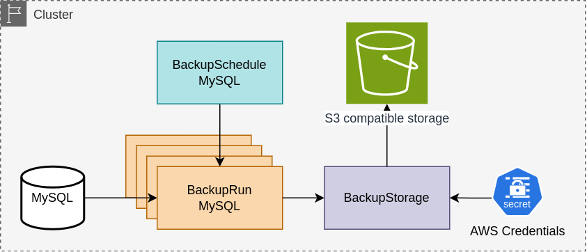
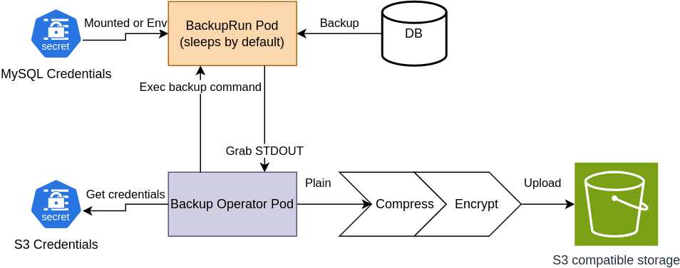
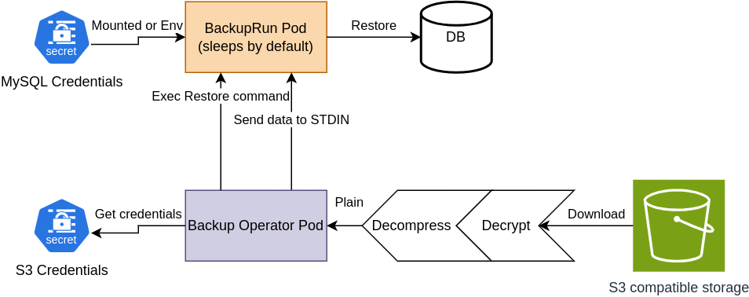

Introduction
===

The operator allows you to create a simple schedule and/or manually initiate *BackupRuns* to back up or restore any data you need. You define the script for backup and restoration yourself, while the operator takes care of compression, encryption, rotation, and storage.



## Concept

There are a core ideas that operator follows.

1. We can backup and restore anything, user defines the script for backup/restoration
2. We do not need backups of volumes or VMs, only data
3. We have to be able to perform both backup and restoration from a standard Docker image
4. Operator must not store any intermediate data and have to stream all the data in/out the storage
5. There have to be a Pod per backup, no execs to running Pods with actual databases

## Backup flow



1. Operator creates a Pod where exec will be executed
2. Backup command in executed: stdin and stderr are ignored, stdout is grabbed as a data
3. Operator compresses the data with [gzip](https://pkg.go.dev/compress/gzip) in stream
4. Compresses stream is encrypted with [age](https://pkg.go.dev/filippo.io/age)
5. Result stream is uploaded to the file in the [S3 storage](https://pkg.go.dev/github.com/aws/aws-sdk-go/service/s3)
6. Operator kills the Pod

## Restore flow



1. Operator creates a Pod where exec will be executed
2. Operator reads file from the storage
3. Decryption of the stream
4. Decompression of the stream
5. Restore command in executed: stdout and stderr are ignored, stdin is provided with plain data
6. Operator kills the Pod once the backup command ends

## Example

```yaml
apiVersion: backup-operator.io/v1
kind: BackupStorage
metadata:
  name: minio
spec:
  type: s3
  parameters:
    bucket: backups
    endpoint: http://minio.minio.svc:9000
    insecure: 'true'
    s3ForcePathStyle: 'true'
  credentials:
    name: minio-credentials
    namespace: minio
```

You define all commands yourself, so operator can backup anything you want.

```yaml
apiVersion: backup-operator.io/v1
kind: BackupSchedule
metadata:
  name: mysql-daily
spec:
  schedule: "0 0 * * *"
  concurrencyPolicy: Replace
  successfulRunsHistoryLimit: 14
  failedRunsHistoryLimit: 2
  template:
    spec:
      retainPolicy: Delete
      storage:
        name: minio
        # Path is templated with http://masterminds.github.io/sprig/
        path: /backups/mysql-{{ now | date "2006.01.02-15:04:05" }}.sql
      # Command for pod exec for making a backup
      backup:
        deadlineSeconds: 300
        container: mysql
        command: ["/bin/sh", "-c"]
        args:
        - mysqldump -h "${HOSTNAME}" -u "${USERNAME}" "-p${PASSWORD}" "${DATABASE}"
      # Command for pod exec for making a restoration
      restore:
        deadlineSeconds: 300
        container: mysql
        command: ["/bin/sh", "-c"]
        args:
        # Backup data will be passed to STDIN
        - mysql -h "${HOSTNAME}" -u "${USERNAME}" "-p${PASSWORD}" "${DATABASE}"
      template:
        spec:
          restartPolicy: Never
          containers:
          - name: mysql
            image: mysql:8.3.0
            command: ["sleep", "1d"]
            env:
            - name: HOSTNAME
              value: mysql.development
            - name: DATABASE
              value: backend_db
            - name: USERNAME
              valueFrom:
                secretKeyRef:
                  name: mysql-credentials
                  key: username
            - name: PASSWORD
              valueFrom:
                secretKeyRef:
                  name: mysql-credentials
                  key: password
```
